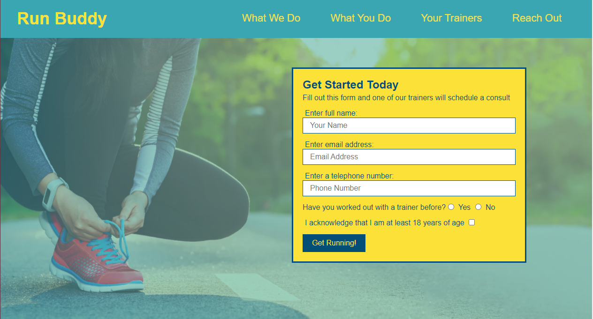

# professional-portfolio - David Lopez

## Motivation

In an attempt to display my works and previous projects, I deployed this Portfolio as a way to encourage potential employers to look my way for hire. In the realm of impressing by means of personal projects, it's important to make things look pleasing to the eye as well. Therefore, I wanted to really 'flex' my CSS skills and make a Portfolio that not only hits all the marks for functionality but looks good too.

## Why did I build this?

I want to provide potential employers or clients with an easy and efficient way to measure my work and abilities. I created this portfolio using my leading projects to show off what I can do on a grander scale.

'''md

## Problems Encountered and Solutions

Problems were prevalent throughout the entirety of this project but the job and most common tool a developer has at their disposal is their ability to work around. I encountered issues with the media queries, but was able to locate the root of my issues which was not using the correct tags and ids to affect the style of my elements on smaller screen sizes. Once I realized this I quickly found that I would no longer be making that mistake across whichever language I am coding in, I'll always keep a close eye and make sure to look at the simple solutions first when something isn't working.